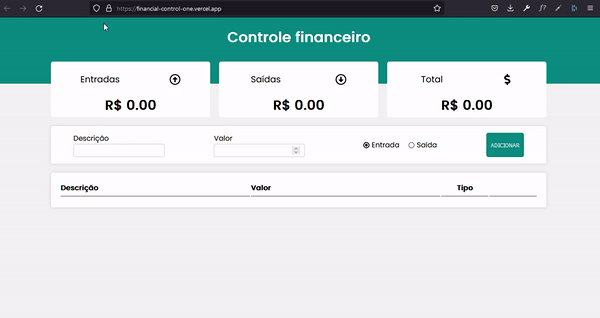

<h1 align="center">
    Financial control
</h1>

  

  

<h4 align="center">
  Project created for you to control your finances, inserting your expenses and expenses and increase your assets
</h4>

  <a href="#rocket-technologies">Technologies</a>&nbsp;&nbsp;&nbsp;|&nbsp;&nbsp;&nbsp;
  <a href="#memo-license">License</a>

  

  

## :rocket: Technologies

- [ReactJS](https://reactjs.org/)
- [react-router-dom](https://github.com/ReactTraining/react-router)
- [styled-components](https://www.styled-components.com/)
- [VS Code][vscode] with [EditorConfig][vceditconfig] and [ESLint][vceslint]

## :memo: License

This project is under the MIT license. See the [LICENSE](https://github.com/andresntos/financial-control/blob/master/LICENSE) for more information.

---

Made with by André antos :wave: [Get in touch!](https://www.linkedin.com/in/andre-sntos/)

[vscode]: https://code.visualstudio.com/
[vceditconfig]: https://marketplace.visualstudio.com/items?itemName=EditorConfig.EditorConfig
[vceslint]: https://marketplace.visualstudio.com/items?itemName=dbaeumer.vscode-eslint
